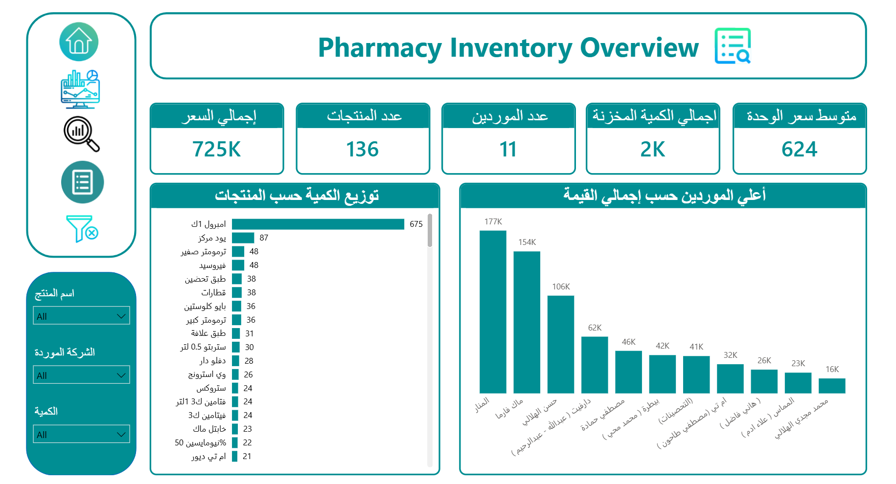
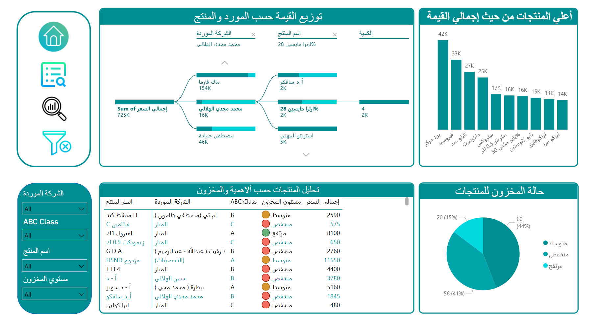
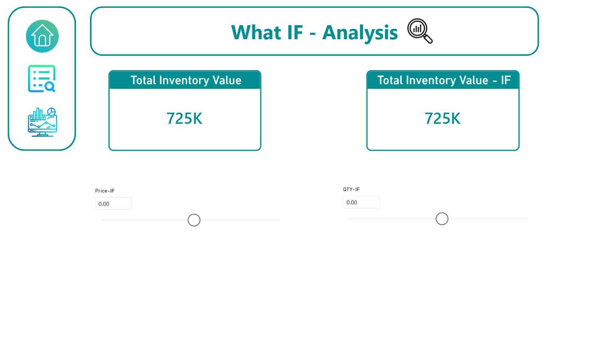

<h1 align="center">💊 Pharmacy Inventory Dashboard | Power BI</h1>

  Interactive Power BI Dashboard for Pharmacy Inventory & Stock Management Analytics

  
  
  

<h2>📌 Overview</h2>

Interactive dashboard built using Power BI to analyze pharmacy inventory performance and stock management KPIs.

<h2>🛠️ Tools Used</h2>

<ul>
  <li>📊 Power BI</li>
  <li>📗 Excel Dataset</li>
  <li>⚙️ Power Query</li>
  <li>🧮 DAX</li>
</ul>

<h2>🖼️ Dashboard Preview</h2>

  

  

  

<h2>📈 Key Insights</h2>

<ul>
  <li>✅ Monitored inventory performance through key operational KPIs and stock metrics</li>
  <li>✅ Analyzed product availability, stock quantity, and supplier distribution trends</li>
  <li>✅ Evaluated inventory value and average unit price to support inventory optimization</li>
  <li>✅ Delivered data-driven insights to improve inventory management and operational efficiency</li>
</ul>

<h2>🌐 Live Dashboard</h2>

  

<h3 align="center">⭐ If you like this project, give it a star ⭐</h3>
